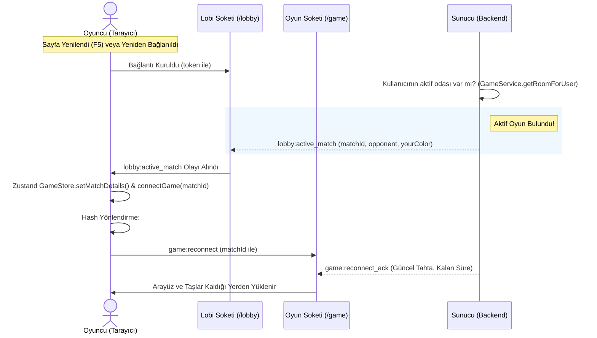

# Mangala Prime — Hatalar ve Bağlantı Yenileme (Reconnection) Raporu

Bu dosya, oyunda tespit edilen mevcut hataları ve bir oyuncunun bağlantısı koptuğunda (veya sayfayı yenilediğinde) aynı masaya nasıl tekrar bağlanacağını detaylandırmaktadır.

---

## 1. Tespit Edilen Hatalar ve Çözüm Planları

### Hata 1: Taş Renklerinin Değişmesi / Yanıp Sönmesi (Flashing)
- **Nedeni**: Sunucudan her yeni hamle veya durum güncellemesi geldiğinde, `initializeBoard()` fonksiyonu sıfırdan taş objelerini yok edip yeniden oluşturmaktadır. Bu durum, taşların başlangıçta rastgele atanan renklerinin değişmesine ve görsel olarak rahatsız edici yanıp sönmelere neden olmaktadır.
- **Çözüm**: `MangalaBoard.ts` içerisine **Taş Havuzu (Stone Pooling)** algoritması eklenerek, mevcut taşların yok edilmesi yerine kuyu bazında korunması veya eksik/fazla durumlarda havuzdan geri kazanılması sağlanacaktır.

### Hata 2: Oyuncu Perspektifinin Yanlış Olması (P2'nin Altta Oynayamaması)
- **Nedeni**: Mangala çift kişilik bir oyundur. İkinci oyuncu (Player 2) kendi ekranında kuyuları altta görmelidir. Mevcut durumda her iki oyuncu da Player 1 perspektifiyle görmektedir.
- **Çözüm**: `MangalaBoard.ts` ve `MangalaReactBoard.tsx` bileşenlerine `yourColor` (perspektif) parametresi eklenecek ve `yourColor === 1` (Player 2) ise tüm kuyu merkezleri ve sınırları görsel olarak 180 derece döndürülecektir (Visual Board Rotation).

### Hata 3: Hamle Sonrası Sıra Geçiş Gecikmesi (Turn Transition Delay)
- **Nedeni**: Hamle yapıldıktan sonra tüm taşların fiziksel olarak tam olarak durmasını (hızlarının sıfırlanmasını) bekleyen gecikmeli bir kontrol mekanizması vardır. Bu, oyunu hantal hissettirmektedir.
- **Çözüm**: Son taş hedefine ulaştığı an animasyon tamamlanmış sayılacak (`onAnimationComplete` anında tetiklenecek) ve fizik motoru arka planda taşları yerleştirmeye devam ederken etkileşimler hemen açılacaktır.

### Hata 4: Rakip Taş Kazanımlarında Yanlış Kuyu Animasyonu (Opponent Capture Desync)
- **Nedeni**: Rakip taş kazandığında (örneğin capture / kuyu boşaltma), frontend'deki hamle başlangıç kuyusu tespiti yanlış yapılmakta ve animasyonlar hatalı tetiklenmektedir.
- **Çözüm**: `GamePage.tsx` içerisinde son hamleyi yapan oyuncunun ID'si (`prevPlayerIdRef`) takip edilerek, taşların hangi kuyudan toplanmaya başlandığı kesin olarak saptanacaktır.

### Hata 5: Lobiye Dönünce Mavi Ekran Kalması (Blank Blue Page)
- **Nedeni**: Sayfa geçişlerinde PixiJS uygulamasının (`app.destroy()`) güvenli bir şekilde yok edilememesi ve tarayıcıda hata fırlatıp React ağacını çökertmesi.
- **Çözüm**: `MangalaReactBoard.tsx` unmount aşamasında PixiJS yok etme kodu try-catch bloğuna alınacak ve doğru parametrelerle temizlenecektir.

### Hata 6: Yerel Ağdan (LAN IP) Oyuna Bağlanamama
- **Nedeni**: Web uygulamasının `192.168.1.107:5173` LAN adresinden açılmasına rağmen, API ve WebSocket bağlantılarının doğrudan `192.168.1.107:3000` portuna istek atması ve host üzerindeki güvenlik duvarı (UFW) kurallarının port 3000'i engellemesi.
- **Çözüm**: Vite geliştirme sunucusuna proxy (`vite.config.ts` altında) eklenecek; böylece tüm istekler `5173` portu üzerinden `/api` ve `/socket.io` şeklinde taşınarak arka plana (port 3000) yönlendirilecektir. UFW port engeli bypass edilmiş olacaktır.

### Hata 7: Oyundan Çekilme (Terk Etme / Forfeit) Butonunun ve Soket Handler'ının Olmaması
- **Nedeni**: Oyun devam ederken oyuncuların oyundan çekilip lobiye dönmesini sağlayan bir buton arayüzde bulunmamaktadır. Ayrıca backend `game.gateway.ts` dosyasında, oyuncudan gelen çekilme isteğini alıp `gameService.handleAbandon()` metodunu çağıracak bir `@SubscribeMessage` dinleyicisi tanımlanmamıştır.
- **Çözüm**: 
  1. Backend `game.gateway.ts` dosyasına `@SubscribeMessage('game:abandon')` handler'ı eklenecek ve bu handler `gameService.handleAbandon()` metodunu çağıracaktır.
  2. Frontend `GamePage.tsx` ekranına "Oyundan Çekil" butonu eklenecektir. Tıklanınca onay istendikten sonra soket üzerinden `game:abandon` mesajı gönderilecektir.

---

## 2. Oyuncu Bağlantı Kopması ve Yeniden Bağlanma (Reconnection) Akışı

### Mevcut Durumda Eksiklik Nedir?
1. **Zustand Durum Kaybı (Page Refresh - F5)**:
   - Oyuncu oyun esnasında F5 yaparsa veya sayfayı kapatıp tekrar açarsa, tarayıcı hafızasındaki `matchId` sıfırlanır (`null` olur).
   - `GamePage.tsx` bileşenindeki yönlendirme kodu, `matchId` değerini bulamadığı için kullanıcıyı otomatik olarak `/lobby` sayfasına atar.
   - Kullanıcı lobiye yönlendiğinde, aktif bir oyunda olduğunu belirten hiçbir arayüz veya bildirim gösterilmez. Kullanıcı lobide takılı kalır, bu esnada sunucudaki 60 saniyelik geri sayım biter ve hükmen mağlup sayılır.

---

### Çözüm: Kesintisiz Yeniden Bağlanma Mekanizması

Oyuncunun bağlantısı koptuğunda veya sayfa yenilendiğinde oyuna kaldığı yerden devam edebilmesi için aşağıdaki akış kurulacaktır:



### Yapılacak Değişiklikler

#### 1. Arka Plan (NestJS) Tarafı:
- **`lobby.gateway.ts`** içinde, bir kullanıcı lobi soketine bağlandığı an (`handleConnection`), `gameService.getRoomForUser(userId)` fonksiyonu ile aktif bir oyunu olup olmadığı kontrol edilir.
- Eğer aktif bir oyun odası bulunursa, istemciye hemen `game:active_match` adında bir event fırlatılır:
  ```typescript
  const activeRoom = this.gameService.getRoomForUser(userId);
  if (activeRoom) {
    client.emit('game:active_match', {
      matchId: activeRoom.matchId,
      opponentUsername: userId === activeRoom.player1Id ? activeRoom.player2Username : activeRoom.player1Username,
      opponentElo: userId === activeRoom.player1Id ? p2Elo : p1Elo,
      yourColor: userId === activeRoom.player1Id ? 0 : 1,
    });
  }
  ```

#### 2. Ön Yüz (React & Zustand) Tarafı:
- **`lobby.store.ts`** içerisine `game:active_match` dinleyicisi eklenecektir.
- Bu event tetiklendiğinde:
  1. `useGameStore.getState().setMatchDetails(...)` ile oyun bilgileri güncellenecektir.
  2. `useGameStore.getState().connectGame(matchId)` çağrılarak oyun soketi (`/game`) bağlanacaktır.
  3. `window.location.hash = '#/game'` yapılarak kullanıcı otomatik olarak oyun sayfasına taşınacaktır.

---

### Hata 8: Ekran Yerleşim ve Mobil Ölçekleme Sorunları (iPhone 14 Pro Max ve Genel Mobil Görünüm)

#### 1. Dikey Ekran (Portrait) Hataları:
- **Nedeni**: `MangalaReactBoard.tsx` dosyasında tahta konteynerine `minHeight: '450px'` inline stili verilmiştir. Mobil dikey ekranda genişlik dar olduğu için (örneğin iPhone 14 Pro Max'te 430px), PixiJS tahtayı 16:9 oranını koruyarak yaklaşık 225px yüksekliğinde çizer. Konteyner 450px yüksekliğinde kalmaya zorlandığı için tahtanın altında ve üstünde devasa boşluklar (toplamda ~225px boşluk) oluşur ve tahta çok küçük görünür.
- **Çözüm**: Hardcoded `minHeight: '450px'` inline stili kaldırılacaktır. Tahta konteynerine CSS `aspect-ratio: 16 / 9` verilerek dikey ekranda yüksekliğinin genişliğe göre otomatik ölçeklenmesi sağlanacak, böylece boşluklar yok edilecektir.

#### 2. Yatay Ekran (Landscape) Hataları:
- **Nedeni**: Yatay modda ekran yüksekliği çok dardır (örneğin 430px). Ancak hem lobi chat panelinin `height: 480px` stili, hem de tahtanın `minHeight: '450px'` zorlaması nedeniyle oyun alanı dikeyde ekrana sığmaz. Bu da tahtanın alt kısmının (1. oyuncunun oynayacağı kuyuların) tamamen ekranın dışına taşmasına/kesilmesine ve chat mesaj/yazma kutusunun kaybolmasına neden olur.
- **Çözüm**: 
  - Yatay medyada (`@media (max-height: 520px) and (orientation: landscape)`) `min-height` değerleri sıfırlanacak (`min-height: 0 !important`).
  - `.game-content-container` ve `.board-panel-container` flex/grid yapısı `100vh` yüksekliği aşmayacak şekilde (`overflow: hidden` ve `max-height: calc(100vh - headerHeight)`) sınırlandırılacaktır.
  - Tahta ve sohbet paneli ekran yüksekliğine göre dinamik olarak küçülecektir.

